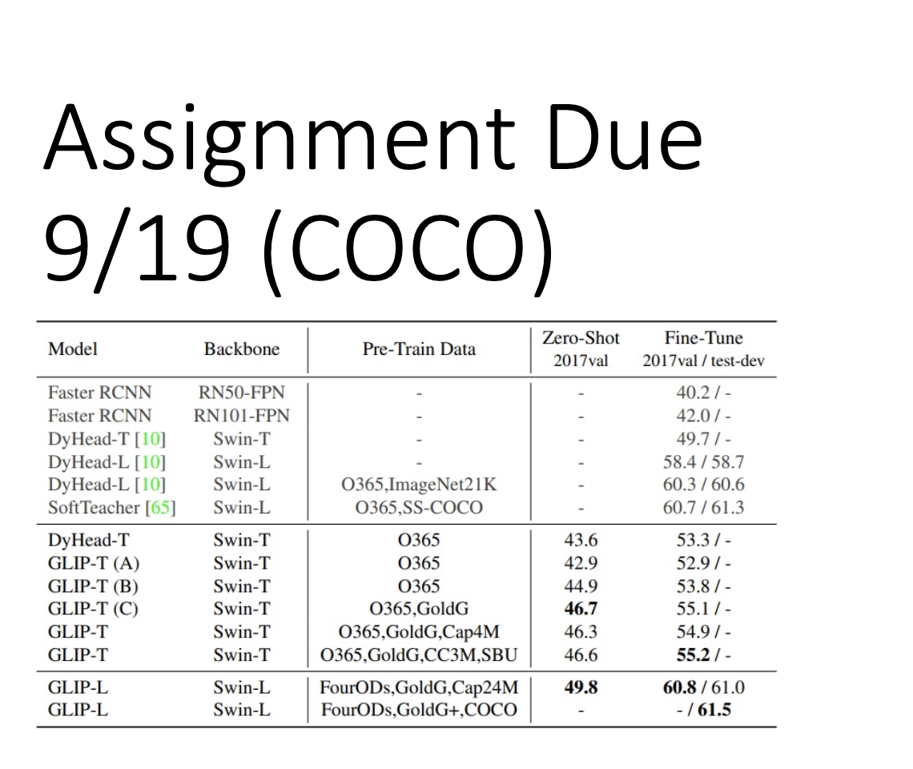

# GLIP

### Ground Language Image Pre-training

**contents:**

- [Ground Language Image Pre-training](./README.md/#GLIP)
- [Architecture](./README.md/#architecture)
- [Assignment](./README.md/#Assignment)

<h1 id = "Assignment">✍️ Assignment</h1>

            

